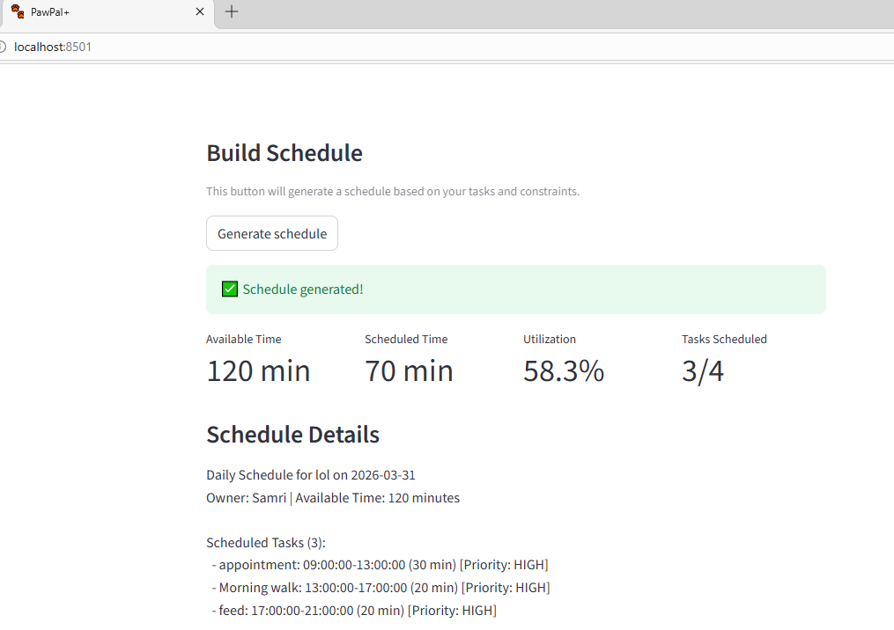

# PawPal+ (Module 2 Project)

You are building **PawPal+**, a Streamlit app that helps a pet owner plan care tasks for their pet.

## 📸 Demo



## Scenario

A busy pet owner needs help staying consistent with pet care. They want an assistant that can:

- Track pet care tasks (walks, feeding, meds, enrichment, grooming, etc.)
- Consider constraints (time available, priority, owner preferences)
- Produce a daily plan and explain why it chose that plan

Your job is to design the system first (UML), then implement the logic in Python, then connect it to the Streamlit UI.

## What you will build

Your final app should:

- Let a user enter basic owner + pet info
- Let a user add/edit tasks (duration + priority at minimum)
- Generate a daily schedule/plan based on constraints and priorities
- Display the plan clearly (and ideally explain the reasoning)
- Include tests for the most important scheduling behaviors

## Getting started

### Setup

```bash
python -m venv .venv
source .venv/bin/activate  # Windows: .venv\Scripts\activate
pip install -r requirements.txt
```

### Suggested workflow

1. Read the scenario carefully and identify requirements and edge cases.
2. Draft a UML diagram (classes, attributes, methods, relationships).
3. Convert UML into Python class stubs (no logic yet).
4. Implement scheduling logic in small increments.
5. Add tests to verify key behaviors.
6. Connect your logic to the Streamlit UI in `app.py`.
7. Refine UML so it matches what you actually built.
\
## Smarter Scheduling

PawPal+ now features a smarter scheduling system that:

- Prioritizes tasks based on urgency, duration, and dependencies
- Assigns each task to the best available timeblock, respecting owner preferences and constraints
- Ensures tasks are scheduled in full (not split across timeblocks), matching real-world pet care needs
- Handles recurring tasks and enforces task order when required
- Provides clear explanations for why tasks are scheduled or left unscheduled

These improvements make daily plans more realistic, efficient, and easier for pet owners to follow.

# Testing PawPal+

To run the test suite and verify system behavior, use the following command:

```bash
python -m pytest
```

**Test Coverage:**
- Task completion and status changes
- Adding and removing tasks for pets
- Owner and pet management
- Time block duration and task fitting
- Task priority logic
- Sorting tasks by time
- Recurring task logic (e.g., daily tasks create new occurrences)
- Conflict detection (e.g., overlapping/duplicate times)

These tests cover both standard and edge-case scenarios to ensure robust scheduling, recurrence handling, and conflict detection.

**Confidence Level:**

⭐⭐⭐⭐☆ (4/5 stars)

Most critical scheduling and recurrence behaviors are tested and pass. The system is reliable for typical use and edge cases, but further real-world testing is recommended for production deployment.

## Features

- Priority-aware scheduling: Sorts tasks by priority level (`HIGH`, `MEDIUM`, `LOW`), with longer tasks preferred first within each priority tier.
- Dependency-aware ordering: Keeps tasks with `must_follow_task` after their prerequisite whenever possible.
- Time-window matching: Prefers timeblocks that match `morning`, `afternoon`, or `evening` task preferences.
- Greedy timeblock assignment: Assigns each task to the best available block that fits its full duration and tracks unscheduled tasks when capacity is limited.
- Feasibility checks and warnings: Compares total task minutes to available owner minutes and warns when requests exceed available time.
- Multi-pet scheduling support: Builds schedules for all pets for a single owner and reports overall utilization.
- Conflict warnings: Detects missing dependencies, circular dependencies, overloaded time windows, overlap risks, and high-priority overload warnings.
- Recurrence expansion: Expands recurring tasks across multiple days based on frequency (`DAILY`, `WEEKLY`, `BIWEEKLY`, `MONTHLY`, `ONE_TIME`).
- Task completion workflow: Marks tasks complete with timestamps and can create next recurring occurrences.
- Sorting utilities: Includes helpers for sorting by scheduled start time, preferred time window, duration (ascending/descending), and priority + time.
- Task filtering utilities: Supports filtering by status, pet, category, priority, and recurrence.
- Per-pet analytics summary: Reports per-pet totals, active/completed counts, duration totals, and completion percentage.
